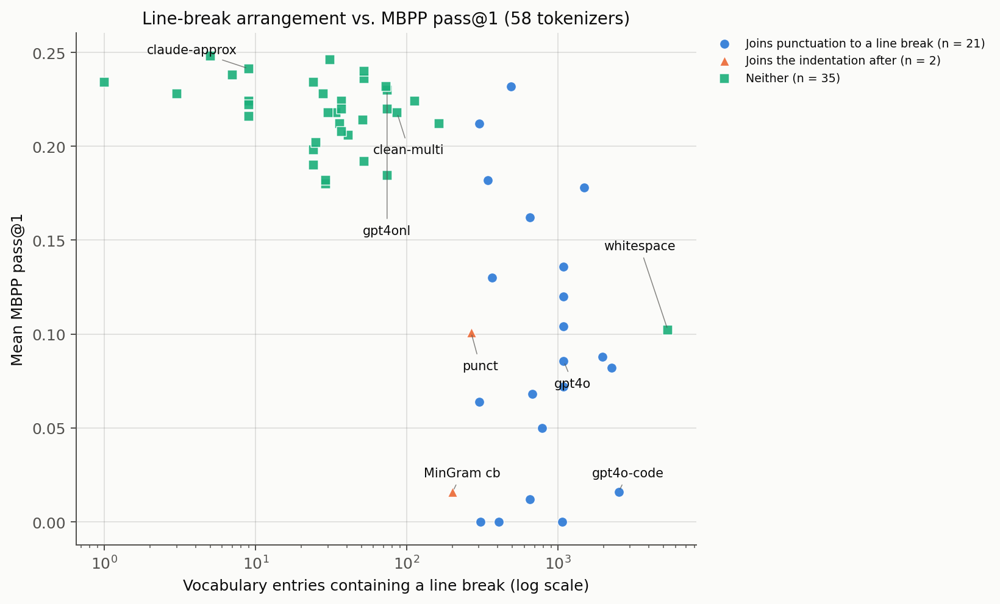
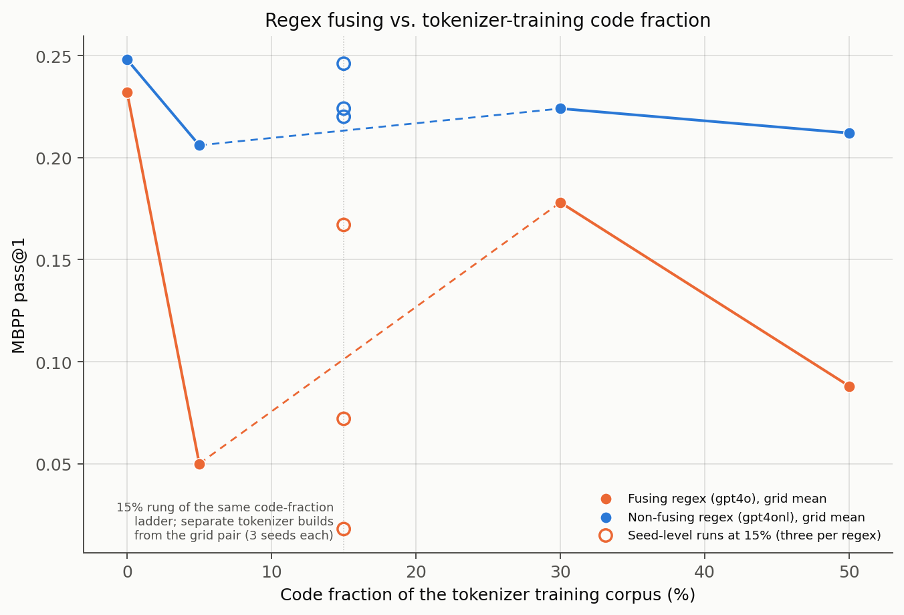
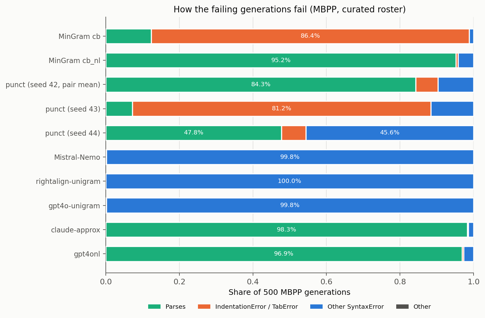
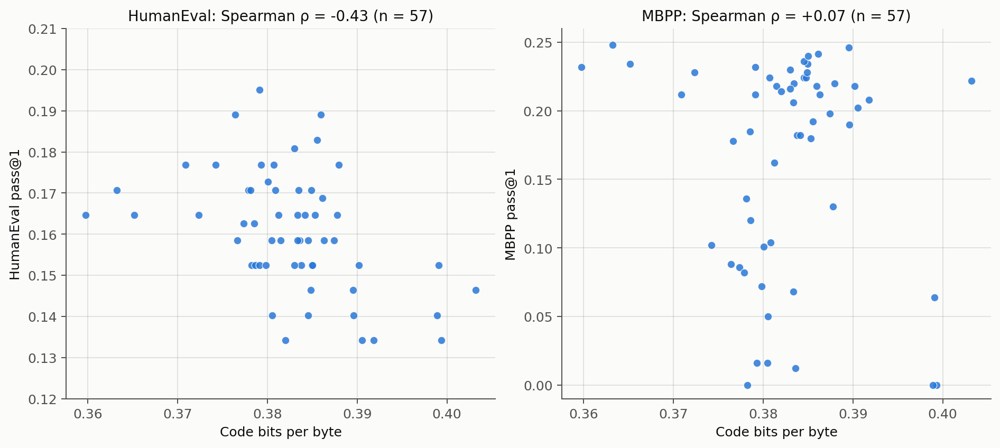

# MBPP from 0.000 to 0.250, changing only the tokenizer

*This is a companion post to the TokEval paper ([Meister, 2026](https://arxiv.org/abs/2608.18062)).*

> **In brief.** We analyze 70 training runs of code-specialized language models that differ only in their tokenizer. We evaluate on MBPP and HumanEval, two widely-used Python coding benchmarks. Mean MBPP pass@1 across the 58 distinct tokenizers spans 0.000 to 0.248, and the highest single run reaches 0.250. The quantity that correlates most strongly with the score is the number of vocabulary entries that contain a line break. Two types of such entries are associated with low scores, and each has its own controlled comparison. Whether either type can form is fixed by the pretokenizer regex, before any tokenizer training starts. A second defect, unrelated to the regex, leaves out single byte entries from the vocabulary silently: one of our tokenizers cannot represent `{` at all. Both defects are detectable from the tokenizer file alone, in seconds.

Each section starts with a summary box. A reader who wants the argument/takeaways and not the details can read the boxes alone.

## Background and preliminaries

> **In brief.** A regex splits text into pretokens before the vocabulary-learning algorithm runs, and no vocabulary entry crosses a pretoken boundary, so the regex fixes which character sequences can become vocabulary entries. (One algorithm below, SuperBPE, switches partway through training to a second regex that draws fewer boundaries; the rule still holds under whichever boundaries are in force.) Five vocabulary-learning algorithms appear in this post: BPE, Unigram, SuperBPE, parity-aware BPE, and MinGram. The 70 training runs cover 58 distinct tokenizers and are identical in every other respect. MBPP requires the model to generate every formatting character in its answer, and HumanEval does not. A reader who already knows all of this can resume at [the next section](#tokenizing-code).

### How a tokenizer is built
#### Pretokenization

A modern tokenizer does not run its vocabulary-learning algorithm on raw text. **Pretokenization** runs first: the breaking up of strings into **pretokens**, which are basically just substrings. The vocabulary-learning algorithm then operates within pretokens only: in BPE, no merge ever crosses a pretoken boundary, and in algorithms that prune down an initial set rather than merge them, no candidate entry in the initial set ever crosses one. Pretokenization therefore fixes which character sequences can become vocabulary entries, before any learning starts. The rule holds throughout: merges never cross the pretoken boundaries in force at the time they are made. One algorithm below, SuperBPE, changes what those boundaries are partway through training, which is a different thing from removing them.

In a bit more detail: pretokenization is typically done with a simple regular expression (regex), a list of clauses that each specify a pattern in text. Given a string, the regex scans it left to right; at each position the clauses are tried in order, and the first clause that matches produces the pretoken there. Spans that no clause matches also become pretokens.[^1]  **SCRIPT encoding** is one procedure that falls into the pretokenization category without being a regex: it groups consecutive characters by character class, so a run of letters of one script forms one pretoken, and the line feed, the tab, and the space share one whitespace class. The two MinGram tokenizers in this post use it.
[^1]: This is the standard way to treat unmatched spans, but most libraries let you set this configuration. E.g., in HuggingFace, via the `SplitDelimiterBehavior` parameter.

---
 
**Example (GPT-4o pretokenization).** The pretokenization regex of GPT-4o has the following seven (!!) clauses.
 
| # | Clause | Text it matches |
|---|---|---|
| 1 | `[^\r\n\p{L}\p{N}]?[\p{Lu}\p{Lt}\p{Lm}\p{Lo}\p{M}]*[\p{Ll}\p{Lm}\p{Lo}\p{M}]+(?i:'s\|'t\|'re\|'ve\|'m\|'ll\|'d)?` | An optional single leading character that is neither a line break, a letter, nor a digit, then a run of letters ending in lowercase, then an optional English contraction suffix |
| 2 | `[^\r\n\p{L}\p{N}]?[\p{Lu}\p{Lt}\p{Lm}\p{Lo}\p{M}]+[\p{Ll}\p{Lm}\p{Lo}\p{M}]*(?i:'s\|'t\|'re\|'ve\|'m\|'ll\|'d)?` | The same, for a run of letters that begins with at least one uppercase letter |
| 3 | `\p{N}{1,3}` | One to three digits |
| 4 | `` ?[^\s\p{L}\p{N}]+[\r\n/]*`` | An optional single space, then a run of characters that are neither whitespace, letters, nor digits, then any number of line breaks and forward slashes |
| 5 | `\s*[\r\n]+` | Whitespace ending in one or more line breaks |
| 6 | `\s+(?!\S)` | A run of whitespace that is not followed by a non-whitespace character |
| 7 | `\s+` | A run of whitespace |
 
Consider the following string, in which the second line is indented by four spaces.
 
```
print(x);
    foo();
```
 
The regex produces six pretokens. The table below gives, for each one, the clause that produced it.
 
| Pretoken | Clause | Why |
|---|---|---|
| `print` | 1 | The optional leading character matches nothing, since `p` is a letter. The uppercase run is empty. The lowercase run matches `print` and stops at `(`. |
| `(x` | 1 | The optional leading character matches `(`, and the lowercase run matches `x`. |
| `);\n` | 4 | Clauses 1 to 3 fail at `)`, because clauses 1 and 2 both require at least one letter after the optional leading character. Clause 4 matches `);` as a run of non-alphanumeric, non-whitespace characters, and its trailing `[\r\n/]*` extends the match over the line break. |
| three spaces | 6 | Clause 4 fails, because it requires a non-whitespace character after the optional space. Clause 5 fails, because no line break follows the indentation. Clause 6 matches the longest run of spaces that is followed by another space, which is three of the four. |
| `` foo`` | 1 | The optional leading character matches the fourth space, and the lowercase run matches `foo`. |
| `();\n` | 4 | As for `);\n` above. |
 
---

Most of the discussion below is surrounding one particular regex class and how it's handled. The class `[^\s\p{L}\p{N}]` matches any character that is neither whitespace, nor a letter, nor a digit, which is to say punctuation and symbols. Which clauses in a regex this class appears in determines which pretokens whitespace is allowed to be part of. We'll later see the downstream effects of this choice.


#### Learning Algorithms

Five **vocabulary-learning algorithms** appear in this post.

**BPE** ([Sennrich et al., 2016](https://arxiv.org/abs/1508.07909)) starts from the corpus represented as just bytes or characters and learns a vocabulary by merging adjacent token pairs (within a given pretoken, of course) into a new token. Merges are chosen greedily: the most frequent pair is merged, and this repeats until the vocabulary reaches its target size. The resulting vocabulary is the initial byte or character alphabet plus the set of merged sequences; in the byte-coverage section below, we talk about what happens when that initial alphabet is incomplete.

**Unigram** ([Kudo, 2018](https://arxiv.org/abs/1804.10959)) starts from a large set of candidate entries and removes candidates one batch at a time, keeping the ones whose removal would most reduce the likelihood of the training corpus under a model that treats tokens as independent. It selects entries rather than building them by merges; the pretoken boundaries apply to it as a limit on which candidate strings enter the initial set.

**SuperBPE** ([Liu et al., 2025](https://arxiv.org/abs/2503.13423)) is BPE run in two stages with two pretokenization regexes. The first stage uses an ordinary regex. Partway through training, the second stage switches to a reduced regex that draws a subset of the first one's boundaries, so the pretokens get coarser (e.g., a rule that split on whitespace is dropped, and a span of several words becomes one pretoken). Merges still never cross a pretoken boundary; there are simply fewer boundaries to respect, so later merges can produce entries that the first stage's boundaries would have blocked, such as entries spanning more than one word.


**Parity-aware BPE** ([Foroutan et al., 2025](https://arxiv.org/abs/2508.04796)) is BPE with a modified merge criterion that balances compression across languages rather than maximizing it in aggregate. Sixteen of the 58 tokenizers in this study use it.

**MinGram** ([Land, 2026](https://arxiv.org/abs/2606.27019)) is a minimalist variant of UnigramLM that offers better compression than the original algorithm.

**Aside: Tokenizer naming scheme used in this post**: Every custom tokenizer in this post is named `<pretokenizer>-<tokenizer training corpus>-<algorithm>`, sometimes with a modifier between corpus and algorithm. So gpt4o-balanced-bpe is the GPT-4o pretokenizer, our balanced tokenizer training corpus (described in the next section), and BPE. Running text shortens names to the distinguishing parts (gpt4o, gpt4o-code, gpt4onl, clean-multi, punct, claude-approx for our Claude reconstruction, scripttok-mingram-scriptenc_cb); the appendix tables show the full names.

### What we trained

The 70 runs cover 58 distinct tokenizers: 53 tokenizers have one run each, five have three seeds each (the five in the Appendix B seed table), and two of those five, gpt4o-balanced-bpe and punct-balanced-bpe, each have a fourth run repeating seed 42, giving 58 + 10 + 2 = 70. Each run uses the same 24-layer transformer body, the same training data (a mixture of math and code, 50/50 by bytes, about 20 billion tokens), and the same step count of 19,073. Total parameters are about 1.27 billion for the runs whose vocabularies have 128K to 131K entries, and higher for the two runs whose vocabularies hold 200,000 entries, because their embedding tables are larger.[^2]
[^2]:The two are pabpe-nfc-clean-fineweb2full-consv2-eusino-v2c-frde-kr120-gm130k-v200k and pabpe-nfc-clean-fineweb2full-consv2-eusino-v2c-gm120k-v200k; a larger vocabulary could raise the line-break count studied below by size alone, but it does not here, since those two hold 28 and 29 entries containing a line break, among the lowest values in the study. The tokenizer is otherwise the only axis of variation.

Scores are **seed-stratified** throughout the post. For replicate runs that share a random seed, we average those together first, and the mean for a tokenizer is then taken over the seed-level values.

The tokenizer training corpora are separate, smaller corpora taken from the same sources as the model training data. The "**balanced**" corpus is a sample of roughly 10 GB drawn document by document. Its draw is weighted 37 percent English (FineWeb-Edu), 33 percent multilingual (30 languages from FineWeb2, with Russian largest at 10.1 percent), 15 percent math (FineMath), and 15 percent code (10 percent Python and 5 percent JavaScript, from StarCoderData). Those weights come with two qualifications. They weight the draw of documents, not of bytes, so a source with longer documents contributes more bytes than its weight suggests. For the "**code**" corpus, the draw is 50 percent English and 50 percent code, across Python, JavaScript, Java, and C++. The "**english**" corpus is drawn from FineWeb-Edu alone. The four grid corpora in [controlled comparisons](#controlled-comparisons) follow the "balanced" scheme but with the code fraction moved to 0, 5, 30, and 50 percent and the other sources rescaled.

### How we evaluated

We evaluate on two generation benchmarks: MBPP ([Austin et al., 2021](https://arxiv.org/abs/2108.07732)) and HumanEval ([Chen et al., 2021](https://arxiv.org/abs/2107.03374)). 

On **MBPP**, the model writes a complete Python function from the first character, prompted with three worked examples. Every line break and every indentation character in the answer is emitted by the model. A typical problem consists of the task text "Write a function to count the most common words in a dictionary." plus three test lines, one of which is:

```
assert count_common(['one', 'two', 'three', 'four', 'five', 'one', 'two', 'one', 'three', 'one']) == [('one', 4), ('two', 2), ('three', 2), ('four', 1)]
```

Its reference solution is a four-line function built on `collections.Counter`, and the model must produce something equivalent from scratch. On **HumanEval**, the model completes an already-started function body (starting from inside its indentation), with no other problems shown as worked examples The prompt supplies just the function header and the indentation context. A typical prompt, which the model continues from inside the function body:

```
def greatest_common_divisor(a: int, b: int) -> int:
    """ Return a greatest common divisor of two integers a and b
    >>> greatest_common_divisor(3, 5)
    1
    >>> greatest_common_divisor(25, 15)
    5
    """
```

Both benchmarks are scored with **pass@1**, the fraction of problems whose generated program passes the tests. 

These benchmarks differ in an important property: whether the model or the prompt supplies the formatting syntax. A defect in emitting line breaks and indentation is therefore measurable on MBPP and barely measurable on HumanEval. Across the same models, HumanEval pass@1 spans 0.134 to 0.195, a range of 0.061. On MBPP, the range is 0.248.

The same evaluation configuration is used for all the numbers cited in this post, pass@1 values and failure-mode rates alike:

1. The beginning-of-sequence token is prepended to the generation context. This is the token that starts every document during training.
2. Generation stops at the document-boundary token.
3. Token healing is applied at the prompt boundary.
4. Decoding is greedy throughout: one generation per problem, no sampling, and a cap of 256 generated tokens.

**Token healing.** As is standard for language model evaluations, the prompt is encoded by the language model's tokenizer before being input to the model. For some tokenizers, that encoding ends in the middle of a token: the prompt's final characters form the start of a token that, in any tokenization of prompt plus continuation, would extend past the prompt's end. Generation then starts from a position that never occurs in the training tokenization. Token healing ([Dagan et al., 2024](https://arxiv.org/abs/2402.01035)) drops the trailing token or tokens of the prompt encoding, restarts generation from the shortened context, and constrains decoding to reproduce the dropped characters before continuing freely. As an example, under our whitespace-split tokenizer, `def add(a, b):` plus a line break encodes with the line break as its own final token, but in the full solution that same line break sits inside the token `\n    return`; the prompt-only encoding therefore ends at a boundary that never occurs in training, and healing re-encodes from the earlier boundary and re-emits the dropped characters. Appendix B shows what happens when we don't use this protocol.

Noise in a single run's MBPP score can come from several places. We estimate random seed noise to try account for it in our results: the **seed standard deviation** of a configuration is the standard deviation of its score across runs that differ only in random seed. It measures run-to-run spread with everything else held fixed. Five configurations were trained with three seeds each on the math+code mixture; we report the exact values in Appendix B.  We see empirically that the magnitude of random seed noise actually depends on the tokenizer. The largest of the five seed standard deviations is 0.1026, and it corresponds to a tokenizer with no entries joining punctuation to a line break. Its three seed-level values span 0.008 to 0.211, even though tokenizer, training data, and step count are identical. Our rule of thumb follows from that table. We do not interpret a single-run MBPP difference smaller than about twice the relevant configuration's seed standard deviation, and we do not assume that standard deviation is small without measuring it. 

There are two further evaluations that we use in a few select places. **Bits per byte** is the model's loss on held-out text divided by the number of bytes of that text, so that tokenizers with different vocabularies can be compared on one scale; lower values indicate a better fit. **BLiMP** ([Warstadt et al., 2020](https://arxiv.org/abs/1912.00582)) is a benchmark of minimal sentence pairs that differ in one grammatical property, scored as the fraction of pairs in which the model assigns higher likelihood to the grammatical member.

## Tokenizing code

> **In brief.** Producing natural-language text is an arguably more forgiving task than producing code. In natural-language text, a missing punctuation mark, line break or indentation character might not look as polished, but almost always still accomplishes a user's task. Such missing components in code, however, mean the program does not parse. Pretokenization plays a large part in determining whether line breaks are processed by the model as a single token, or inside a longer token together with things like the function definitions and punctuation before it, the indentation after it, etc. When it occurs inside a longer token, one generation step must then produce the line break and its neighboring characters together in a single, decision-laden step. We found that the number of vocabulary entries containing a line break correlates with mean MBPP pass@1 at rho = -0.719 across the 58 tokenizers (as in, more entries -> worse performance). Two pretokenization choices are associated with low scores: allowing a line break to join to the punctuation run before it, and allowing a line break to join to the indentation after it. A third convention, in which a line break can only join to the whitespace before it, is actually associated with the highest scores across the 58 tokenizers: the highest tokenizer mean in the study, 0.248, belongs to a tokenizer of this convention. Which convention a tokenizer can produce is determined by one or two clauses of its pretokenizer regex.

In natural-language text, many different segmentations of the same sentence are consistent with the same correct output. The segmentation introduced by a tokenizer can change how efficiently a model learns, but not which outputs count as correct. A missing comma or unclosed brace still produces interpretable text. The situation with code is different: single characters determine (a very concrete definition of) correctness. A line break ends a Python statement, and the indentation on the following line assigns that line to a block; a digit's position sets its place value, a brace opens or closes a scope; one wrong character and the program does not parse, or the number is wrong. A model that cannot reliably emit a line break or an indentation character in the right place cannot produce a correct Python program, however accurate the rest of its output is.

Tokenization fixes, before model training starts, which of these characters occur in the training stream as entries of their own and which occur mostly inside longer entries. When line breaks occur mostly inside longer entries, a model must learn which punctuation and whitespace characters are in each token. Producing a program that parses then requires emitting those longer entries at exactly the right positions and potentially making several impactful decisions at once. Pretokenization is the part of the tokenization pipeline that determines whether such entries can actually form during tokenizer training.

For digits, the impact of pretokenization choices has already been measured. Singh and Strouse ([2024](https://arxiv.org/abs/2402.14903)) studied digit-grouping conventions in frontier models and found that how digits are chunked into tokens measurably changes arithmetic ability. For code formatting syntax, and for line breaks and indentation in particular, we know of no comparable measurement.

### The association across all 58 tokenizers

In every tokenizer, we measure the number of vocabulary entries that contain a line-break character (a line feed `\n` or a carriage return `\r`). Across the 58 tokenizers,[^3] this count correlates with mean MBPP pass@1 at Spearman rho = -0.719 (a rank correlation: both quantities are converted to ranks, and the correlation of the ranks is reported, from -1 for perfectly opposed orderings to +1 for identical orderings; p = 2.1e-10). This correlation is the most stable measurement in the post. Three different ways of aggregating across the tokenizers give correlations between -0.70 and -0.73: Restricted to the 56 tokenizers that we train ourselves, the correlation is rho = -0.705; Grouping near-duplicate tokenizers into 27 configuration families and taking one tokenizer per family, the correlation is -0.73. So, yeah, the finding is pretty robust in this context. 
[^3]:The TokEval paper ([Meister, 2026](https://arxiv.org/abs/2608.18062)) reports the same comparison over its 20-tokenizer math+code panel, and its values differ slightly for that reason; Appendix C states why.

Another statistic to back up this finding: Mean MBPP pass@1 across the 21 tokenizers with at least one entry joining punctuation to a line break is 0.095 vs. 0.206 across the 37 with no such vocabulary entries. Under a Mann-Whitney rank-sum test, which pools and ranks all values and measures how often a value from one group outranks a value from the other, that difference is significant (p = 3.0e-7), with the caveat that the 58 tokenizers are not independent design points, so the implicit independence assumption of the test is violated.


### New line characters in a token = bad?

So then is it just bad for model coding performance to have vocab entries with `\n`? We look into this a bit more. There are several ways that whitespace can appear inside a vocabulary entry. This can be seen by looking at just a few of our tokenizers and counting their vocab entries that contain a line break. Between some of these rows, the difference is only a single tokenizer design choice (e.g., gpt4o -> gpt4o-code or gpt4o -> gpt4onl) . We see a large spread in MBPP pass@1. 

| Tokenizer (short name) | What the line break can join to | Entries containing a line break | Mean MBPP pass@1 |
|---|---|---|---|
| gpt4o | The punctuation run before it | 1,091 | 0.086 |
| gpt4o-code | The punctuation run before it (code-heavy tokenizer training corpus) | 2,522 | 0.016 |
| gpt4onl | Only the whitespace before it | 74 | 0.230 |
| clean-multi | Only the whitespace before it | 86 | 0.218 |
| scripttok-mingram-scriptenc_cb | The indentation after it | 201 | 0.016 |
| punct | The indentation after it (as in scripttok-mingram-scriptenc_cb) | 266 | 0.101 |
| claude-approx | Nothing; whitespace is split by type | 9 | 0.241 |

The obvious conclusion here would just be that the more vocabulary entries with line break characters -> the worse your coding model is going to perform. But several of the above examples speak against that simple conclusion. More entries containing a line break are not necessarily bad. In the gpt4onl and clean-multi rules, the clause matching line breaks begins with `\s*`, so spaces preceding a line break can join the line-break pretoken. In those tokenizers, we get 74 and 86 entries containing a line break. Mean MBPP pass@1 for those two tokenizers is 0.230 and 0.218, among the highest in the study. What the two poorly-performing tokenizers, gpt4o-code and scripttok-mingram-scriptenc_cb (both at 0.016), have in common is that a line break can join a character that is load-bearing for Python syntax: the punctuation before it for gpt4o-code, the indentation after it for scripttok-mingram-scriptenc_cb. The count of entries containing a line break is therefore a proxy: what it stands in for is which characters the pretokenizer lets a line break join, not the number of entries as such.

A note on the table: punct and scripttok-mingram-scriptenc_cb place a line break in the same pretoken as the indentation that follows it, so punct is a second instance of that convention, not a third convention; the punct vocabulary holds 247 such entries against 187 for scripttok-mingram-scriptenc_cb. The difference between them is consistency. The model trained with scripttok-mingram-scriptenc_cb (MinGram cb in the figure below) fails on indentation in 86.4 percent of its generations, while the punct models do so in one seed out of three (81.2 percent for that run, against 9.4, 2.6 and 6.6 percent for the others).



*Every tokenizer in the study, placed by its count of entries containing a line break (log scale) and its mean MBPP pass@1. Color marks what a line break can join: blue circles join punctuation to a line break, orange triangles join the line break to the indentation after it, and green squares do neither. Two tokenizers land on exactly the same point and are drawn slightly apart so both stay visible.*

### The pretokenization choice(s) that permit whitespace inside tokens

Code corpora contain many lines like `print(x);` or `if something(x):` followed by a line break. So sequences like `);` and `):` occur frequently next to `\n` in our tokenizer's training corpus. There are two ways such examples could be handled when we're segmenting the text into pretokens. If the pretokenizer regex clause that matches punctuation runs may continue across a following line break, then `);\n` (and possible characters before or after it) will be a single pretoken. That pretoken is frequent, BPE merges frequent adjacent pairs within a pretoken, and after enough merges the vocabulary contains `);\n` as a single entry. If the regex instead splits before every line break, `);` is one pretoken and `\n` is another. No sequence of merges can join them, so that entry cannot form, at any vocabulary size, on any corpus. Let's come back to the GPT-4o punctuation clause as an example:

```
 ?[^\s\p{L}\p{N}]+[\r\n/]*
```

This regex matches: an optional space, then one or more punctuation or symbol characters, then zero or more characters from the set carriage return, line feed, `/`. So `);` or `):` followed by a line break becomes a single pretoken together with it: `);\n`, `):\n`. The vocabulary of gpt4o-balanced-bpe, trained with this regex, contains 1,024 entries in which a punctuation character is followed immediately by a line break. As examples, here are the eleven with vocabulary ids below 1,000 (low ids mean early, high-frequency merges): `.\n` (id 306), `)\n` (427), `:\n` (466), `,\n` (481), `.\n\n` (563), `;\n` (589), `)\n\n` (700), `):\n` (780), ` {\n` (834), `);\n` (868), and `"\n` (957). The variant of this tokenizer fit on a code-heavy corpus, gpt4o-code, contains 2,350 such entries.


**A concrete edit.** Preventing the case where new lines can attach to punctuation runs takes one deletion in the case of the above GPT-4o-style regex:

```
 ?[^\s\p{L}\p{N}]+[\r\n/]*      before
 ?[^\s\p{L}\p{N}]+              after
```

That deletion is the only difference between the two tokenizers in the first [controlled comparison](#controlled-comparisons) below, and the count of entries joining punctuation to a line break falls from 1,024 to 0.

Depending on what other clauses are in the pretokenization regex, some additional edits may have to be done. For instance, if there's another clause later in the regex that matches another of the above mentioned failure cases, that would also have to be modified. Leaving whitespace unmatched by every clause is also not a good option. As mentioned in [the pretokenization primer](#Pretokenization), a span that no clause matches is kept as a single pretoken. That span extends over every consecutive character that no clause matches, so a any character next to the whitespace that also doesn't match any clause will be placed in the same pretoken. Merges within that pretoken can then produce tokens that combine whitespace with punctuation, letters, or digits. HuggingFace's `WhitespaceSplit` pretokenizer takes the opposite approach and discards whitespace entirely. Under this scheme, inputs that differ only in whitespace produce identical token sequences. The implication of this is that the model has no way of learning (or emitting) the different types of whitespaces, which would be a disaster if you were trying to have your model write Python code.

There's another pretokenizer whitespace-handling case worth mentioning, as it likewise had a large impact on code performance (discussed in the [controlled comparisons](#controlled-comparisons) section): under SCRIPT encoding, the new line, the tab, and the space belong to one shared character class, so a line break and the indentation that follows it form one pretoken. This isn't the earlier situation we discussed of having line breaks join with punctuation. It's literally just whitespace joining different types of whitespace. When looking at the MinGram tokenizers that use this SCRIPT encoding, we'll see that this method of handling whitespace also negatively impacts code performance. 

### Open-source tokenizers

Many widely-used tokenizers use the trailing line break paradigm. The LLaMA-3 vocabulary contains 2,257 entries containing a line break, of which 2,050 join a punctuation run to one. The Mistral-Nemo vocabulary contains 1,070 and 1,064 respectively, and its pretokenizer clause for handling punctuation is identical to GPT-4o's.

Tokenizers from LLMs, including those for dedicated code models,  are divided on whether they allow vocabulary entries joining whitespace to punctuation. Of the five code models we audited, three have no entry with a line break joined to a punctuation run: StarCoder2-3B, stable-code-3b, and phi-2. Amongst those, phi-2 has only 4 entries containing a line break of any kind. StarCoder2-3B does allow other whitespace merges though: it has 456 vocab entries where a line break is joined to the whitespace run after it. Qwen2.5-Coder-3B and CodeGemma-2B, though, allow entries joining a punctuation run to a line break and have 1,977 and 291 such entries, respectively. Those models are trained on far more code than our 20-billion-token runs, and they perform well. Importantly, our findings are not at odds with these records. They simply state what this one choice does at our scale, with everything else held fixed.

## Controlled comparisons

> **In brief.** Deleting one pretokenizer regex clause, with the tokenizer training corpus held fixed, moves mean MBPP pass@1 from 0.086 to 0.230 across three seeds per tokenizer, and the two seed ranges do not overlap. Adding one line-break rule to the pretokenizer regex for an unrelated tokenizer family changes it from 0.016 to 0.216. We do a 2x4 grid that varies the pretokenizer regex clause and the fraction of code data in the tokenizer training corpus independently: at all code fractions, the model trained with the tokenizer that does not allow new lines to fuse to punctuation runs scores at or above its counterpart that does. On the other hand, there is no consistent performance ranking according to tokenizer training data's code fraction.

### One regex clause, three seeds per tokenizer

gpt4o-balanced-bpe and gpt4onl-balanced-bpe are two tokenizers fit on the same corpus. They differ only in one clause of their pretokenizer regex. Specifically, in the latter,  the trailing `[\r\n/]*` is gone from the punctuation clause of the pretokenizer regex, i.e., new lines are not allowed to fuse to punctuation runs. With this change alone, the count of vocabulary entries joining a line break to punctuation falls from 1,024 to 0. We trained code-specialized language models (three seeds) on each.

| Tokenizer | Entries joining punctuation to a line break | MBPP pass@1 per seed | Mean | Seed SD |
|---|---|---|---|---|
| gpt4o-balanced-bpe | 1,024 | 0.167\*, 0.072, 0.018 | 0.086 | 0.0754 |
| gpt4onl-balanced-bpe | 0 | 0.224, 0.246, 0.220 | 0.230 | 0.0140 |

\* The seed-42 value is the mean of two runs both trained with that seed, 0.174 and 0.160.[^4]

The two score ranges do not overlap: the worst-performing seed for the tokenizer prohibiting punctuation-to-line-break fusing scores 0.220. This is  above the highest score for any of the seeds trained with the tokenizer allowing this fusing. The means across seeds differ by 0.144. The deletion also makes the scores more stable: the three runs for the tokenizer prohibiting punctuation-to-line-break fusing span 0.026 points, where for the other tokenizer, values span 0.149 points. So removing one character class from a pretokenizer regex clause raises the mean and reduces variance at once.

[^4]:One disclosure about the fusing side's seed-42 value: the two runs for that seed fall on either side of a documented rebuild of the training software environment. The canonical run was trained in 2026-04, before the rebuild, and a same-seed, same-configuration retrain was trained in 2026-08. The pair reproduces closely. Validation bits per byte is 0.3352 against 0.3356, MBPP pass@1 is 0.174 against 0.160, and HumanEval is identical at 0.1646. The magnitude of the MBPP movement is within the noise across seeds. 

### Changing line break treatment in an unrelated tokenizer family

We repeat a similar contrast with the pretokenization scheme used by the SCRIPT-encoded MinGram pair, which is quite different from the GPT-4o regex family. What we refer to as the "cb" variant is the tokenizer whose pretokenization allows line breaks to be part of the same pretoken as the indentation after it; the "cb_nl" variant adds a single rule to the pretokenizer and is otherwise identical. It adds a forced pretoken boundary at line-break characters. The models trained using the cb and cb_nl tokenizers (one training run each) achieve MBPP pass@1 of 0.016 and 0.216, respectively. This is a pretty dramatic difference... To make sure this isn't just noise, we perform an exact McNemar test (a paired comparison over the 500 problems in the eval set, counting only the problems that exactly one model solves). The cb_nl model solves 104 problems the cb model misses and misses 4 that it solves. Under this test, the improvement from cb to cb_nl is significant with p-value of 3.4e-26. That p-value comes with a caution: the test compares this one pair of runs, so it tells us that the difference between these two specific models' performance on this benchmark is significant. It doesn't say anything about whether a retrain of the models with different seeds would show a similar result.

### The regex clause and the tokenizer training corpus, varied independently

Maybe the punctuation-to-line-break fusing clause only matters when the tokenizer training corpus is code-heavy? The third comparison tests this hypothesis. We fit tokenizers using the gpt4o and gpt4onl pretokenizer regex discussed in the first comparison, on each of four corpora with code fractions of 0, 5, 30, and 50 percent (described in [What we trained](#what-we-trained)). That gives us eight tokenizers in total. We trained one language model on each; the language-model training data is identical across all eight runs. As a sanity check, we checked the vocabulary. As the code-data fraction  rises the gpt4o-based tokenizers (the ones allowing punctuation-to-line-break fusing) have 482, 749, 1,393, and 1,831 vocab entries joining punctuation to a line break. Every gpt4onl-based tokenizer has zero.

| Code fraction of the tokenizer training corpus | Fusing regex (gpt4o) | Non-fusing regex (gpt4onl) | Non-fusing minus fusing | McNemar p |
|---|---|---|---|---|
| 0% | 0.232 | 0.248 | +0.016 | 0.41 |
| 5% | 0.050 | 0.206 | +0.156 | 2.5e-16 |
| 30% | 0.178 | 0.224 | +0.046 | 0.0076 |
| 50% | 0.088 | 0.212 | +0.124 | 4.7e-12 |

In short, the model trained with the non-fusing tokenizer scores at or above its fusing counterpart at every code fraction. Every score in the table comes from a single training run, and the same warning about the p-value from the previous section applies. 



*Performance of the eight models in the code-training-data grid. At every code fraction, the model whose tokenizer has non-fusing regex performs above the fusing counterpart. The open circles at 15 percent are the three-seed pair from the first comparison: separate tokenizer builds on the same training data.*

Reading down a column, it can look as though a code-heavier tokenizer training corpus -> lower score for the models trained on that tokenizer. But this is not a significant trend. Neither column is ordered by tokenizer training corpus code fraction and within each column, the rank correlation between code fraction and MBPP pass@1 is rho = -0.400 (p = 0.600, n = 4 rungs). Two other evaluations on the same eight tokenizers show concrete benefits of including code in tokenizer training data. HumanEval pass@1 is highest at 50 percent code in both columns: 0.189 and 0.195 at 50 percent vs. 0.165 and 0.171 at 0 percent. Bits per byte on held-out math+code data decreases (improves) monotonically as the code fraction rises: from 0.3396 at 0 percent to 0.3348 at 50 in the fusing column, and from 0.3420 to 0.3366 in the non-fusing column. The [code bits per byte](#code-bits-per-byte) section below returns to a related measure, computed on held-out code, over the full set of tokenizers.

<!-- **Miscellaneous.** One commonly-used configuration deserves its own warning. The off-the-shelf HuggingFace whitespace-split pretokenizer attaches every whitespace run to the text after it, so a line break is always mid-token in training, and a prompt that ends with one therefore uses a token that is "out-of-distribution" for code data. In the three cells short of the full protocol, the model trained with this pretokenizer scores 0.006 to 0.016 on MBPP; fully healed and with the beginning-of-sequence token it reaches 0.102. The improved score still isn't great (perhaps because the whitespace handling isn't ideal!), but this case exemplifies just how big an impact evaluation protocol can have.  -->

## How the failing generations fail

> **In brief.** We passed every model's scored MBPP generation through Python's `compile()`, which parses without executing. For the generations that did not compile, we recorded the exception type. Models trained with tokenizers that allowed joining of a line break to the indentation after it had an `IndentationError` on 86.4 percent of generations. When the tokenizer allowed joining a line break to the punctuation run before, the corresponding models' generations failed with `SyntaxError` and a low parse rate instead. A closer analysis points to the harm happening during training, in what the model gets to practice, and showing up throughout its generations rather than at the moments one of these entries is emitted. The comparison that leads us to this explanation has confounds, which we state below, so we offer it as the better-supported explanation and not as an established one.

For the model trained with the scripttok-mingram-scriptenc_cb tokenizer, which allows a line break to join the indentation after it, 86.4 percent of MBPP generations fail with `IndentationError` or `TabError`, and 12.4 percent parse. For its cb_nl counterpart, 0.6 percent fail on indentation and 95.2 percent parse. For the claude-approx tokenizer, whose vocabulary contains 9 entries containing a line break, 0.3 percent fail with `IndentationError`. The failing generations break at exactly the boundary the pretokenizer joined: the model emits a bare line break without the indentation that Python requires on the following line, and `compile()` raises `IndentationError`.

Tokenizers that allow punctuation-to-line-break fusion give way to models that have a different failure mode. For gpt4o-code-bpe, whose vocabulary contains 2,350 entries joining punctuation to a line break, 92.4 percent of generations fail with `SyntaxError` and 7.6 percent parse, while the indentation-failure rate is 0.000.

The table lists the six tokenizers with the lowest MBPP parse rates, with the median over the 58 tokenizers for scale. Rates are shares of the 500 MBPP generations, seed-stratified. In Python, `IndentationError` and `TabError` are subclasses of `SyntaxError`; the classification checks for them first, so the two error columns are disjoint and the `SyntaxError` column holds only other parse failures.

| Tokenizer | Parses | IndentationError or TabError | SyntaxError | Mean MBPP pass@1 |
|---|---|---|---|---|
| Mistral-Nemo | 0.000 | 0.002 | 0.998 | 0.000 |
| gpt4o-balanced-unigram | 0.000 | 0.002 | 0.998 | 0.000 |
| rightalign-balanced-unigram | 0.000 | 0.000 | 1.000 | 0.000 |
| gpt4o-code-bpe | 0.076 | 0.000 | 0.924 | 0.016 |
| scripttok-mingram-scriptenc_cb | 0.124 | 0.864 | 0.012 | 0.016 |
| superbpe-apertus-fineweb2full-capped-hybridwindow\* | 0.128 | 0.024 | 0.848 | 0.012 |
| Median over the 58 tokenizers | 0.938 | 0.006 | 0.049 | |

\* superbpe-apertus-fineweb2full-capped-hybridwindow is SuperBPE fit on a capped FineWeb-2 corpus with NFC normalization. Its pretokenizer, derived from the Mistral-Nemo one, lets a punctuation run extend across a following line break, and its vocabulary holds 613 entries joining punctuation to a line break.



*How models' MBPP generations parse, split by what `compile()` raises. The two failure types show up as color: models trained with a tokenizer that joins a line break to the indentation after it fail with `IndentationError` (orange), while the models scoring 0.000 fail almost entirely with other kinds of `SyntaxError` (blue). The three punct rows correspond to one tokenizer with three seeds of model training.*

Across the 58 tokenizers, the median MBPP indentation-failure rate is 0.006 and the maximum is 0.864. The three highest rates belong to the scripttok-mingram-scriptenc_cb variant (0.864), gpt4o-english-fullbyte-bpe (0.396), and punct-balanced-bpe (0.313 as a seed-stratified mean over three seeds). The mean score of the punct tokenizer deserves special attention. This tokenizer was one that had large seed instability (documented in [How we evaluated](#how-we-evaluated)): across four models with identical configurations, the identation error rate spans 0.026 to 0.812, with one seed in near-total indentation collapse (0.812, the run scoring 0.008 on MBPP). On the other hand, the run using the canonical seed is at 0.094. 

### Does using a fused entry break the generation it appears in?

We see two plausible routes via which these vocabulary entries could be harming a model. It could be that emitting one of these entries is itself the failure point: the model has to get several characters right in a single step, and the program breaks right there. Or the damage could be done during training, in what the model gets to practice, showing up throughout its generations rather than at the moments one of these entries is emitted. To test for evidence of the former, we checked whether, when a model emits one of these apparently harmful vocab entries, if the program breaks there. To do this, we re-encoded every MBPP generation for the models trained with a punctuation-to-line-break fusing tokenizer. We split these generations into two sets: generations that contained at least one entry joining punctuation to a line break and generations that contain none. Perhaps unexpectedly, in 15 of the 18 tokenizers with at least 20 generations in both groups, the generations that use a fused entry parse more often than the ones that use none; of the remaining three, two are the 0.000-scoring models and one is a near-tie (0.540 against 0.543). For the gpt4o model, rates averaged across its seeds, generations that featured a fused entry had a parse rate of 0.534 against 0.082 for those that didn't; pooled over the seeds, the two groups have 1,406 and 594 generations. We see a similar trend amongst the MinGram models. 0 of its 421 generations that never use a newline-plus-indentation entry parse. This is in comparison to a parse rate of 0.785 for the 79 that do: for that tokenizer, the fused entry really is the only way to produce an indented line that parses.

Of course, there are confounds to any conclusions that can be drawn from this particular analysis. We're not comparing to generations from tokenizers that do *not* feature these tokens, so we don't have a clear baseline. Further, a generation that contains one of these fused entries marks a generation where the model got far enough in solving the problem. It might fail right off the bat for more complex problems, not outputting anything sensical (including an entry joining punctuation to a line break). Still, we take these results as evidence agains the first explanation of how these entries cause harm, since generations that use one of these entries parse more often, not less. Better support for the second explantion comes from the per-example analysis noted in Appendix C, where we find no evidence that a problem's tokenization properties predict which problems a model passes.


## The zero scores, and evaluations that do not show the defect

> **In brief.** Three tokenizers whose models score exactly 0.000 fail with `SyntaxError` on 99.8 percent or more of their generations and almost never on indentation. We read those generations, and all three break at the same spot: the first line of the function definition does not end in the colon Python requires, while two comparison models whose tokenizers have no entries joining punctuation to a line break never fail there. Beyond these three, there are other aspects of standard evaluation setups (including ours) that make it difficult to identify and diagnose potential sources of consistent model failures: HumanEval supplies the formatting syntax in its prompts, code bits per byte shows no association with MBPP at any reporting level, and a single training run contains seed noise larger than many of the differences being compared.

### The three scores of 0.000

Mean MBPP pass@1 is exactly 0.000 for the models trained with Mistral-Nemo, gpt4o-unigram, and rightalign-unigram. All three fail with `SyntaxError` on 99.8 percent or more of their generations and almost never on indentation. We read the generations to see where they break. In Python, the first line of a function definition has to end with a colon, as in `def sort_matrix(matrix):`. The Mistral-Nemo model gets that line wrong in every generation that contains one, 499 of 499; it typically writes the colon and then keeps going, as in `def remove_Occ(s, c):---`. The rightalign-unigram model gets the line wrong in 93.0 percent of its generations that contain one, the gpt4o-unigram model in 66.9 percent, and these two mostly leave the colon out altogether, as in `def sort_matrix(matrix)`. For comparison, two models whose tokenizers hold no entries joining punctuation to a line break, gpt4onl and claude-approx, get that line wrong in exactly zero of their generations. All three zero-score tokenizers do hold such entries: 1,064 for Mistral-Nemo and 302 for each of the other two. So the place these models most often fail is the punctuation-to-line-break junction this whole post is about, at the opening line of the function definition. This check does not account for everything, though: 165 gpt4o-unigram generations and 35 rightalign-unigram generations have a well-formed def header and still fail to parse, and we have not identified what breaks those.

<!-- Truncation does not explain this: the three models reach the 256-token generation cap on 2.4 to 7.4 percent of their generations, vs. 3.6 and 6.2 percent for the two comparison models, and their generations are of ordinary length. (The cap rates are lower bounds, because we re-encode the trimmed generation text rather than the raw token stream.)

The caveats, so this stays honest. Each of these rates comes from a single training run. We checked only the outer function-header line, so a missing colon on a nested definition or an `if` line would not show up. And these numbers alone do not separate the vocabulary explanation from the algorithm one, since two of the three zero-score models use Unigram; worth saying plainly, though, the model failing at 100 percent is the BPE one. Why these vocabularies make the model run past the end of the function header, or never complete it, is not established.
 -->


### HumanEval

On HumanEval, the prompt supplies the function header and the indentation context, so the model actually isn't required to emit the syntax that would require the two classes of whitespace tokens discussed here. HumanEval pass@1 across the same models spans 0.134 to 0.195, a range of 0.061, vs. 0.248 on MBPP. As an informal analysis, we looked at performance of five of our tokenizers on the two benchmarks: whitespace, punct, claude-approx, and the scripttok-mingram-scriptenc_cb and cb_nl pair, the five that recur through Appendix B. With prompt boundaries healed, their indentation-failure rates on HumanEval ranged from 0.0 to 3.7 percent, while the MBPP rates for those same five range from 0.3 percent to 86.4 percent. Our conclusion is that an evaluation that uses HumanEval alone does not expose this type of defect.

### Code bits per byte

A team that never runs generation benchmarks might instead monitor code bits per byte, the bits-per-byte measure from the [how we evaluated](#how-we-evaluated) section, computed on held-out code. For HumanEval, that measure behaves as we would expect: it correlates negatively (lower bits per byte, better HumanEval) with HumanEval pass@1 at every reporting level: rho = -0.43 across the 57 tokenizers; -0.59 over one representative per configuration family (p = 0.002); and -0.49 over family means. However, it shows no association with MBPP at any level: +0.07, -0.12, and -0.04 on the same three levels, every p above 0.5. So a team watching code BPB would see its tokenizers ranked plausibly by code-modeling quality and would still miss syntax generation issues that we observe. A related observation appears in the grid of [controlled comparisons](#controlled-comparisons): held-out math+code bits per byte improves monotonically with the code fraction there, while the MBPP ranking does not follow it.



*Each point is one tokenizer, placed by code bits per byte and pass@1 for the model trained on it. Lower bits per byte goes with higher HumanEval (left) and with nothing on MBPP (right); the two panels use different vertical ranges because the two benchmarks span very different score ranges.*


## Byte coverage

> **In brief.** Given no explicit initial alphabet, the HuggingFace BpeTrainer puts into the base vocabulary only the byte values that occur in its sampled tokenizer training corpus, and raises no error or warning. A byte that never occurred has no vocabulary entry and no unknown-token fallback, so text containing it cannot round-trip. Five of the 58 tokenizers in this study fail a byte round-trip check through this mechanism. One of them cannot represent `{`, and the model trained on it passes 1 of the 22 MBPP problems whose reference solution contains `{`. The fix is to pass an explicit 256-byte initial alphabet and to run the check on every trained tokenizer.


Throughout these experiments, we ran into two separate instances of (unintentional) incomplete byte coverage:

* **The brace defect**: three tokenizers fit on an English-only corpus (gpt4o-english, claude-english, punct-english) are missing critical bytes in their vocabulary, including the opening brace `{`. 
* **The control-byte defect**: the two tokenizers fit with no code in the corpus, the 0 percent rung of the grid, are missing two non-printable bytes used by some programming languages, NUL and the carriage return.


Here we discuss the concrete consequences, focusing on the first defect: gpt4o-english is missing 32 of the 128 tested byte values, among them the carriage return and `{`. The model trained on it cannot emit `{` at all. Twenty-one of its 500 MBPP generations contain an orphaned `}`, for example `res = }` where `res = {}` was intended, and the model passes 1 of the 22 MBPP problems whose reference solution contains `{`. At the overall pass rate of this model, 0.212, about 4.7 of the 22 would be expected to pass. The one pass is a problem whose given tests can be satisfied without writing `{`, and the passing generation contains no brace at all. To measure what the missing bytes change, we trained gpt4o-english-fullbyte, using the identical tokenizer training corpus and settings plus an explicit 256-byte initial alphabet.

| | gpt4o-english (32 bytes missing) | gpt4o-english-fullbyte (byte-complete) |
|---|---|---|
| Bits per byte on held-out balanced-mixture text, 1B balanced models* | 0.7375 | 0.7382 |
| BLiMP, 1B balanced models* | 0.8158 | 0.8168 |
| MBPP pass@1, math+code | 0.212 | 0.064 |
| MBPP parse rate | 0.944 | 0.542 |
| MBPP indentation-failure rate | 0.006 | 0.396 |
| HumanEval parse rate | 0.829 | 0.841 |

\*These results are from models trained on a dataset balanced between English, multilingual, and math+code data. 

The two measurements from balanced models differ by only about a thousandth each, and not in one direction. Bits per byte for the defective tokenizer, on held-out text from that balanced mixture rather than the math+code data of the grid section, is 0.7375 vs. 0.7382 for the byte-complete tokenizer: lower, which is the better direction. BLiMP is 0.8158 vs. 0.8168: lower again, which on this benchmark is the worse direction. Neither margin is large enough to read as a difference between the tokenizers. We also cannot explain one of the table's numbers: the byte-complete tokenizer has one of the highest MBPP indentation-failure rates in the study, 0.396 vs. a median of 0.006, even though its pretokenizer does not let a line break join the indentation after it. We take this result as indication that caution should be taken: tokenizer defects don't always surface obviously. While our results don't indicate that this defect severely impaired the respective model, it ultimately caps performance since the missing bytes may be required in certain settings. Most importantly, this defect was one that was quick to diagnose and easy to avoid. It can be seen by just looking at the vocabulary and solved by passing an explicit 256-byte initial alphabet.

## Scope and limitations

Everything here comes from one architecture, a 24-layer decoder of about 1.27 billion total parameters, and one training mixture of about 20 billion tokens. Most results are based on one benchmark in one programming language. The correlations across the 58 tokenizers are correlational, and those 58 are not independent design points. Seed noise is large and tokenizer-dependent, so single-run comparisons are unreliable. Our controlled evidence covers a single scale: whether these effects persist at production scale is untested. 

We also left some things uncontrolled. Every run takes the same 19,073 optimization steps over the same number of tokens, so a tokenizer that packs the corpus into fewer tokens per byte covers more raw text within that budget; we did not equalize the amount of text seen. Vocabulary size varies from 127,826 to 200,000 entries across the field, and a larger vocabulary could raise the count of entries containing a line break by size alone; as noted in [What we trained](#what-we-trained), the two 200,000-entry tokenizers hold 28 and 29 such entries, among the lowest in the study, so this particular confound did not materialize. The vocabulary-learning algorithm and the pretokenizer also vary together in most of our designs. Even so, the algorithm is not what distinguishes the worst scores: of the three models at exactly 0.000, two use Unigram and one (Mistral-Nemo) uses BPE, while the one Unigram tokenizer with an ordinary score, claude-balanced-unigram at 0.222, has no entries joining punctuation to a line break. The count of such entries sets the three apart from it; the algorithm does not.

What remains unexplained, as of now: why the three zero-score vocabularies make their models break at the function-header colon in the first place (in [the zero scores section](#the-zero-scores-and-evaluations-that-do-not-show-the-defect) we say where the failure happens, not why); the byte-complete rebuild of gpt4o-english sitting near the top of the indentation-failure ranking despite a pretokenizer that keeps line breaks apart from the indentation after them; and why the size of seed noise depends on the tokenizer at all, with punct-balanced-bpe the extreme case (one seed of three at 0.008 while the other two score 0.211 and 0.084).


There are likely similar mechanisms across different programming languages, though we measured none of this: MBPP is Python-only. Other languages have characters comparable to line breaks that a parser requires. In Java and the C family, `;` ends statements and `{`...`}` delimit blocks, and the shipped vocabularies we audited put entries exactly at those junctions (` {\n`, `;\n`, `}\r`). A build with the brace defect could not emit a Java block at all. We state this as a hypothesis about where the same measurements would land in other languages, not as a finding.

## Checklists

> **In brief.** You only need to look at the tokenizer files to check for both of the issues mentioned above. And they are both easily fixable. 

Checks we suggest before training a tokenizer:

1. Look at how your pretokenizer handles whitespace. Evidence here suggests that changing it to avoid new lines binding with punctuation or following indentations can give an easy bump to your model's performance on Python. This change is often as simple as deleting a trailing clause in the pretokenizer regex. 
2. Pass an explicit 256-byte initial alphabet to the trainer, then run the byte round-trip check, plus a round-trip of real multi-script text, before any language-model training.

Checks we suggest before interpreting a code-generation score:

1. Heal the prompt boundary, or verify that it lands on a token boundary for every tokenizer evaluated.
2. Keep beginning-of-sequence handling consistent with training-time packing.
3. Do not compare numbers across evaluation configurations.
4. Measure the seed standard deviation for at least one configuration per tokenizer family before interpreting single-run differences.
5. Include a benchmark on which the model produces complete programs from the first character. Completion-style benchmarks alone do not expose defects in emitting line breaks.


## Appendix A: pretokenization rules used in this study

The post uses ten pretokenizer names. This section gives each one a short entry: what its splitting rule does in plain language, its line-break-relevant clause verbatim, and the answer to one question: can a punctuation run extend across a following line break, so that an entry joining punctuation to a line break can form? For the custom tokenizers the clauses are quoted from our tokenizer-training configuration. For Mistral-Nemo and LLaMA-3 they are read from the shipped tokenizer files. We checked every entry by running its pretokenizer on sample code. Each entry closes with a one-word verdict on the fusing question.

Reading the clauses takes six facts about regex notation. `\p{L}` matches any letter and `\p{N}` any digit. `\s` matches any whitespace character, including line breaks; `\r` and `\n` are the carriage return and the line feed. `[^...]` matches any single character not listed inside the brackets, so `[^\s\p{L}\p{N}]` matches any character that is neither whitespace nor a letter nor a digit: punctuation and symbols. `+` repeats the preceding item one or more times, `*` zero or more times, `?` zero or one time. `|` separates alternative clauses, tried left to right, and each pretoken comes from the first clause that matches. A clause beginning ` ?` therefore starts with an optional single space.

**GPT-4o** (the regex behind gpt4o-balanced-bpe, gpt4o-code-bpe, and the fusing column of the crossed grid). The pretokenizer regex of OpenAI's GPT-4o tokenizer. Its clauses match, in order: words (optionally with one leading character such as a space), digit runs of up to three digits, punctuation runs, and whitespace. The punctuation clause is the one that matters here:

```
 ?[^\s\p{L}\p{N}]+[\r\n/]*
```

An optional space, then one or more punctuation or symbol characters, then zero or more line-break characters (or `/`). Because of the trailing `[\r\n/]*`, the clause keeps matching past the punctuation and into the line break, so a punctuation run may extend across a following line break. `);` followed by a line break is one pretoken, and the entry `);\n` can form. Fuses: yes.

**gpt4onl** (GPT-4o with a line-break split; the non-fusing variant in the controlled comparisons and in the crossed grid). Identical to GPT-4o except that the punctuation clause ends at the punctuation:

```
 ?[^\s\p{L}\p{N}]+
```

A following line break is matched by the separate whitespace clause `\s*[\r\n]+` instead and lands in a pretoken of its own. `);` and the line break can never share a pretoken, so the entry `);\n` cannot form at any vocabulary size, on any corpus. Fuses: no.

**Right-align digits** (rightalign-balanced-bpe). GPT-4o with one changed clause, and it is not the punctuation clause: digits are grouped in threes from the right (1234 splits as 1, then 234) instead of from the left (123, then 4), a change aimed at arithmetic. Its punctuation clause is byte-identical to GPT-4o's, so its vocabulary contains the same count of 1,024 entries joining punctuation to a line break that the body reports for gpt4o-balanced-bpe. Fuses: yes.

**Mistral-Nemo** (off the shelf). We read its splitting rule from the shipped tokenizer file. It differs from the GPT-4o regex in two places: digits are matched one at a time rather than in groups of up to three, and there is no clause for English contractions. Its punctuation clause is byte-identical to GPT-4o's:

```
 ?[^\s\p{L}\p{N}]+[\r\n/]*
```

right down to the `/`. The punctuation-line-break entries in its shipped vocabulary are therefore not a separate design decision; they come from the same clause, in a different vendor's tokenizer. Fuses: yes.

**LLaMA-3** (off the shelf). Also read from the shipped tokenizer file. Its punctuation clause is

```
 ?[^\s\p{L}\p{N}]+[\r\n]*
```

the same shape as GPT-4o's, with the trailing class restricted to line-break characters (no `/`). On the question of this section it behaves the same: a punctuation run may extend across a following line break. Fuses: yes.

**punct** (punct-balanced-bpe). Not a single regex: two splitting stages run in sequence. The first stage isolates punctuation characters one at a time, so `(`, `)`, and `;` each become a pretoken of their own, and no punctuation run of two or more characters remains, let alone one extending across a line break. The second stage splits the remaining text with a general-purpose rule (the GPT-2 splitting regex), under which a line break groups with the whitespace that follows it, never with the punctuation before it. Running the composed pretokenizer on `print(x);` followed by an indented line yields `;` as one pretoken and, as another, the line break plus all but the last of the next line's indentation spaces; the last space attaches forward to the next word. Fuses: no.

**Claude** (claude-balanced-bpe; the body's short name is claude-approx). A reconstruction of the splitting rule of the production Claude tokenizer, recovered by probing its token-counting API (the rule itself is not published). The reconstruction is an early one, and a later round of probing corrected several of its structural claims about letter grouping; the property that matters here, that a punctuation run never extends across a line break, holds in both versions. Its punctuation clause is

```
[ ]?[^\s\p{L}\p{N}]+
```

an optional leading space, then the punctuation run, with no trailing line-break class. Whitespace is split by type into separate clauses: `[ ]+` for spaces, `[\t]+` for tabs, `[\n]+` for line feeds, `[\r]+` for carriage returns. A punctuation run and a following line break therefore always land in different pretokens. The effect is the same as gpt4onl's, arrived at independently. Fuses: no.

**clean-multi** (bpe-nfc-clean-balanced). This project's multilingual-neutral regex. Words are matched with an optional leading space, digits are matched one at a time, and the punctuation clause is ` ?[^\s\p{L}\p{N}]+`, with no trailing line-break class. Line breaks are matched by the separate clause `\s*[\r\n]+`; its leading `\s*` means whitespace before a line break may join the line-break pretoken, but the punctuation before it still cannot. Fuses: no.

**whitespace** (whitespace-balanced-bpe). Two stages again; the first attaches every whitespace run to the pretoken that follows it. Splitting `print(x);` followed by an indented `foo();` yields the pretoken `print(x);` and then a single pretoken holding the line break, the indentation, and `foo();` together. Nothing attaches whitespace to the preceding text, so a punctuation run never extends across a following line break and the fused count is zero. The forward attachment has a consequence of its own: this is the one tokenizer of the fourteen runs in our prompt-boundary audit whose MBPP prompt boundary splits mid-token, because in its training text a line break is always part of the token that starts the next line, and encoding a prompt that ends with a line break leaves that line break at a boundary that never occurs in training. Appendix B returns to this. Fuses: no; whitespace fuses forward instead.

**MinGram cb and cb_nl, with SCRIPT encoding** (scripttok-mingram-scriptenc_cb and scripttok-mingram-scriptenc_cb_nl). The one entry that is neither a regex nor BPE. MinGram is a vocabulary-learning algorithm from a separate project; SCRIPT encoding is its pretokenization scheme. Instead of matching a regex, SCRIPT encoding groups consecutive characters by character class, and it places the line feed, the tab, and the space in one shared whitespace class. In the cb variant a line break and the following indentation therefore form one indivisible pretoken: the line break plus the next line's leading spaces is a single unit, and the vocabulary contains 187 entries that fuse a line break with the following indentation. The cb_nl variant adds one rule, a forced break at line-break characters, and is otherwise identical; under it the line break stands alone, and the count is zero. Punctuation belongs to a different class than whitespace in both variants, so neither variant has an entry joining punctuation to a line break; the cb variant's fusion joins the line break to the indentation after it. This is the pair the controlled comparisons return to. Fuses (punctuation with line break): no, in both; cb fuses the line break with the following indentation instead.

In summary: GPT-4o, Right-align digits, Mistral-Nemo, and LLaMA-3 let a punctuation run extend across a following line break; gpt4onl, punct, Claude, clean-multi, whitespace, and both MinGram variants do not. Two of the non-fusing entries fuse at a different boundary instead: scripttok-mingram-scriptenc_cb joins the line break to the following indentation, and whitespace joins every whitespace run to what follows it.

## Appendix B: evaluation details: seed noise and the prompt boundary
### Seed noise in a single run

The below table gives the measured seed spread across tokenizers. 

| Tokenizer | Vocabulary entries containing a line break | MBPP pass@1 per seed | Seed SD |
|---|---|---|---|
| claude-balanced-bpe | 9 | 0.250, 0.234, 0.240 | 0.0081 |
| gpt4onl-balanced-bpe | 74 | 0.224, 0.246, 0.220 | 0.0140 |
| bpe-nfc-plus2-balanced | 74 | 0.114, 0.212, 0.228 | 0.0617 |
| gpt4o-balanced-bpe | 1,091 | 0.167\*\*, 0.072, 0.018 | 0.0754 |
| punct-balanced-bpe | 266 | 0.211\*, 0.008, 0.084 | 0.1026 |

\* This value is the mean of two runs trained with the same seed, 0.230 and 0.192, three months apart under one software environment.

\*\* The mean of two runs trained with the same seed, 0.174 (2026-04, before an environment rebuild) and 0.160 (2026-08, after it); the pair is discussed in [Controlled comparisons](#controlled-comparisons).

One name in this table appears nowhere else in the post: bpe-nfc-plus2-balanced is a variant of clean-multi (bpe-nfc-clean-balanced), trained on the same balanced corpus with NFC normalization. Its regex adds one prefix clause that attaches apostrophes and the Tibetan word separator to words, and its punctuation clause, like the clean-multi one, has no trailing line-break class.


### The evaluation-configuration ablation and the prompt boundary

For three tokenizers we scored all four combinations of the beginning-of-sequence token and token healing.

| Model (tokenizer) | Benchmark | Neither | Healing only | BOS only | Both | Both against neither, McNemar p |
|---|---|---|---|---|---|---|
| claude-balanced-bpe | HumanEval | 0.1463 | 0.1402 | 0.1707 | 0.1707 | 0.42 |
| claude-balanced-bpe | MBPP | 0.220 | 0.214 | 0.256 | 0.250 | 0.049 |
| scripttok-mingram-scriptenc_cb | HumanEval | 0.0000 | 0.0305 | 0.0854 | 0.1768 | 3.7e-9 |
| scripttok-mingram-scriptenc_cb | MBPP | 0.008 | 0.008 | 0.016 | 0.016 | 0.34 |
| whitespace-balanced-bpe | HumanEval | 0.0000 | 0.0061 | 0.1524 | 0.1768 | 3.7e-9 |
| whitespace-balanced-bpe | MBPP | 0.006 | 0.016 | 0.006 | 0.102 | 9.1e-14 |

One agreement in the table is a verified coincidence, not a transcription error: the scripttok-mingram-scriptenc_cb and whitespace-balanced-bpe HumanEval rows match at 0.0000, 0.1768, and p = 3.7e-9 because both models solve exactly 29 of the 164 problems in the cell with both changes and exactly 0 without them, and the identical scores and identical 29-to-0 McNemar splits follow from those counts.

Both edits are important independently. In the HumanEval rows of the two affected models, the cell with both changes is above each single-ingredient cell. The two changes also matter for different tokenizers and different benchmarks. For the model trained with claude-balanced-bpe, whose prompt boundary is clean, none of the four healing contrasts reaches significance, with all four p-values at 0.25 or above, while adding the beginning-of-sequence token alone raises MBPP pass@1 from 0.220 to 0.256 (p = 0.018). For the whitespace-balanced-bpe model, MBPP pass@1 reaches 0.102 only in the cell with both changes; healing alone moves it just 0.006 to 0.016.

The boundary artifact is tokenizer-dependent. For the four tokenizers in the 16-tokenizer healing check whose pretokenization lets a punctuation or whitespace run extend past a following line break or indentation, encoding the HumanEval prompt alone ends mid-token on 97.6 to 99.4 percent of examples. Across the 14 runs checked on MBPP, the prompt boundary is clean for 13; the exception is whitespace-balanced-bpe, at 99.8 percent split, because its pretokenization attaches every whitespace run to the text that follows it, so a line break at the end of a prompt lands at a boundary that never occurs in training. Without healing, HumanEval pass@1 is exactly 0.0000 for three models, those trained with whitespace-balanced-bpe, punct-balanced-bpe, and scripttok-mingram-scriptenc_cb; with healing it is 0.0061, 0.0671, and 0.0305 respectively.


The evaluation configuration also changes diagnostics, not only scores. The MBPP indentation-failure rate for punct-balanced-bpe's canonical seed-42 run is 9.4 percent under generation-spec v2, against 42.6 percent for the same run in an earlier scoring pass without the beginning-of-sequence token on the generation context. That 42.6 percent was partly an artifact of the missing token. The three-seed stratified mean is 31.3 percent, driven by one seed's collapse; [How the failing generations fail](#how-the-failing-generations-fail) unpacks the per-seed spread.

## Appendix C: tokenizer-only metrics and the configuration-family panel

Ten metrics computed on the tokenizer alone, with no model involved, were correlated with MBPP, HumanEval, and GSM8K. MBPP and HumanEval are the benchmarks from the body; GSM8K ([Cobbe et al., 2021](https://arxiv.org/abs/2110.14168)) is a benchmark of grade-school math word problems, on which the model generates a worked solution and is scored by whether the final number it produces matches the reference answer. Of the 58 tokenizers, 46 enter that analysis, and they group into 27 configuration families whose members agree on corpus, pretokenizer lineage, algorithm, normalizer, and data composition. The correlations below take one representative per family, chosen by a rule applied without reference to results, so that a cluster of near-duplicate designs counts once rather than thirteen times. The rule has four steps: first keep the members that pass the byte round-trip audit; then keep those whose vocabulary lies in the 127,826 to 131,072 band; then take the member with the fewest hyphen-separated name segments; and break any remaining tie lexicographically. Six of the thirty metric-benchmark correlations reach significance after the Benjamini-Hochberg adjustment, and five are listed here; the sixth, tokens per identifier against HumanEval (rho = -0.51, adjusted p = 0.023), is the one cell whose family-mean variant is not significant (adjusted p = 0.22), which flags a result that rides on which member represents its family, so we report it and do not build on it.

| Metric | Benchmark | Spearman rho (n = 27 families) | Adjusted p |
|---|---|---|---|
| Count of vocabulary entries containing a line break | MBPP | -0.73 | 0.00016 |
| Numeric magnitude fertility | HumanEval | -0.75 | 0.00016 |
| AST boundary alignment | MBPP | +0.60 | 0.0049 |
| Digit boundary F1 | HumanEval | +0.61 | 0.0049 |
| Operator isolation, prose corpus | MBPP | +0.54 | 0.015 |

Four of these metrics need a definition. Numeric magnitude fertility is the average number of tokens per digit when numbers are encoded, so lower values indicate that numbers are split into fewer pieces relative to their length. AST boundary alignment is the fraction of token boundaries that land on AST node boundaries in the tree-sitter library parses. Digit boundary F1 measures how closely the tokenizer's split positions inside a number agree with right-aligned three-digit grouping. Operator isolation is the fraction of code operators emitted as standalone tokens, measured here on a prose corpus.


The TokEval paper carries the rest of this analysis: the remaining correlations, the control of the AST correlation for line-break handling, the dependence of each correlation on the training mixture, and the per-example fits, which find no evidence that per-problem tokenization properties predict which problems a model passes.

Values in the paper differ slightly from the values here, because the two documents compute them over different sets of tokenizers and models. The paper's math+code panel holds 20 custom tokenizers, and this post reports over the 58 tokenizers or over the 27 configuration families. Each document states its panel alongside every number.

For reference, every tokenizer count the post reports over, in one place:

| Count | What it is | What it leaves out |
|---|---|---|
| 58 | Every distinct tokenizer with a completed training run under this evaluation protocol | Nothing; this is the full set |
| 56 | The custom-trained tokenizers | The two off-the-shelf references, Mistral-Nemo and LLaMA-3 |
| 46 | The panel behind this appendix's correlations | The two references, the whitespace-split probe, and the nine tokenizers of the grid experiment (the eight grid tokenizers plus their non-fusing base), which were built to manipulate the very quantity being correlated |
| 27 | One representative per configuration family | The near-duplicate members within the 46 |
| 57 | The tokenizers in the code bits per byte comparison | One tokenizer whose text normalizer rewrites characters in a way that changes byte counts, which invalidates its bits-per-byte measurement |
| 26 | Family representatives, and family means, for the code bits per byte comparison | That same tokenizer's family, which has no other member |
| 20 | The TokEval paper's own math+code panel | Everything this post covers beyond that paper's panel; the paper states its own membership rules |
| 18 | The tokenizers in the fused-entry usage comparison | Every tokenizer without at least 20 MBPP generations in each of the two groups (for a tokenizer with no fused entries, the group that uses one does not exist) |

Two further pairs of numbers are splits within these sets rather than panels of their own: the 21 and 37 of the Mann-Whitney comparison divide the 58 by whether the vocabulary holds an entry joining punctuation to a line break, and the 16 and 14 in Appendix B are the number of tokenizers in the healing check and the number of runs checked for a clean MBPP prompt boundary.

## Appendix D: statistical tests

Statistical claims in this post use five tests, and "significant" always means a p-value below 0.05, with every test two-sided.

**Spearman rank correlation.** Both quantities are converted to ranks, and the correlation of the ranks is reported as rho, from -1 for perfectly opposed orderings to +1 for identical orderings.

**Mann-Whitney rank-sum test.** All values from two groups are pooled and ranked, and the test measures how often a value from one group outranks a value from the other. Used once, comparing MBPP pass@1 between the tokenizers with at least one entry joining punctuation to a line break and the tokenizers with none.

**Exact McNemar test.** A paired comparison of two models on the same 500 problems. Problems that both models solve, and problems that both miss, are uninformative about the difference. The test counts the problems that exactly one model solves and computes, from the binomial distribution, the probability of a split at least this uneven if each such problem were equally likely to favor either model.

**Benjamini-Hochberg adjustment.** Applied to families of related correlations in Appendix C. It controls the expected fraction of false positives among the significant results in a family.

**Partial rank correlation.** The rank correlation between two quantities after removing from both the part predicted by a third quantity, computed from the three pairwise rank correlations and tested with a t-test. The TokEval paper uses it to control the AST correlation for line-break handling, as noted in Appendix C.

Two standard deviations recur and measure different things. The seed standard deviation of a configuration is the standard deviation of a score across training runs that differ only in random seed. Where a pooled seed standard deviation is quoted, it is the square root of the mean of the per-configuration seed variances. The standard deviation across a set of tokenizers is used only as a ruler for effect sizes, and it is always stated with the size of the set.

| Claim | Test | n | Statistic | p |
|---|---|---|---|---|
| Count of entries containing a line break against mean MBPP, all 58 tokenizers | Spearman | 58 | rho = -0.719 | 2.1e-10 |
| The same, custom-trained tokenizers only | Spearman | 56 | rho = -0.705 | 1.4e-9 |
| Mean MBPP, tokenizers with entries joining punctuation to a line break against tokenizers with none | Mann-Whitney | 21 and 37 | means 0.095 and 0.206 | 3.0e-7 |
| MinGram pair on the math+code mixture, MBPP | McNemar | 500 problems | 104 solved only by the cb_nl variant, 4 only by cb | 3.4e-26 |
| BOS against no BOS, unhealed, model trained with claude-balanced-bpe, MBPP | McNemar | 500 problems | scores 0.220 and 0.256 | 0.018 |
| Healing against no healing, model trained with claude-balanced-bpe | McNemar | 164 and 500 | four contrasts, score changes 0.000 to -0.006 | 0.25, 0.375, 1.0, 1.0 |

Every count and rate in the fused-entry usage passage carries no row here and no test claim; that comparison fits no model by construction.

## References

- Austin et al., 2021. [Program Synthesis with Large Language Models](https://arxiv.org/abs/2108.07732). arXiv:2108.07732.
- Chen et al., 2021. [Evaluating Large Language Models Trained on Code](https://arxiv.org/abs/2107.03374). arXiv:2107.03374.
- Cobbe et al., 2021. [Training Verifiers to Solve Math Word Problems](https://arxiv.org/abs/2110.14168). arXiv:2110.14168.
- Dagan, Synnaeve, and Rozière, 2024. [Getting the Most Out of Your Tokenizer for Pre-Training and Domain Adaptation](https://arxiv.org/abs/2402.01035). arXiv:2402.01035.
- Foroutan, Meister, Paul, Niklaus, Ahmadi, Bosselut, and Sennrich, 2025. [Parity-Aware Byte-Pair Encoding: Improving Cross-lingual Fairness in Tokenization](https://arxiv.org/abs/2508.04796). arXiv:2508.04796.
- Kudo, 2018. [Subword Regularization: Improving Neural Network Translation Models with Multiple Subword Candidates](https://arxiv.org/abs/1804.10959). arXiv:1804.10959.
- Land, 2026. [MinGram: A Minimalist Unigram Tokenizer with High Compression and Competitive Morphological Alignment](https://arxiv.org/abs/2606.27019). arXiv:2606.27019.
- Liu, Hayase, Hofmann, Oh, Smith, and Choi, 2025. [SuperBPE: Space Travel for Language Models](https://arxiv.org/abs/2503.13423). arXiv:2503.13423 (COLM 2025).
- Meister, 2026. [TokEval: A Tokenizer Evaluation Suite](https://arxiv.org/abs/2608.18062). arXiv:2608.18062.
- Sennrich, Haddow, and Birch, 2016. [Neural Machine Translation of Rare Words with Subword Units](https://arxiv.org/abs/1508.07909). arXiv:1508.07909.
- Singh and Strouse, 2024. [Tokenization Counts: The Impact of Tokenization on Arithmetic in Frontier LLMs](https://arxiv.org/abs/2402.14903). arXiv:2402.14903.
- Warstadt et al., 2020. [BLiMP: The Benchmark of Linguistic Minimal Pairs for English](https://arxiv.org/abs/1912.00582). arXiv:1912.00582.

The models and tools the post names without a citation marker, for completeness: [LLaMA-3](https://arxiv.org/abs/2407.21783) (arXiv:2407.21783), [Mistral NeMo](https://mistral.ai/news/mistral-nemo/), [tree-sitter](https://tree-sitter.github.io/tree-sitter/), [StarCoder2](https://arxiv.org/abs/2402.19173) (arXiv:2402.19173), [Stable Code](https://arxiv.org/abs/2404.01226) (arXiv:2404.01226), [Phi-2](https://www.microsoft.com/en-us/research/blog/phi-2-the-surprising-power-of-small-language-models/), [Qwen2.5-Coder](https://arxiv.org/abs/2409.12186) (arXiv:2409.12186), and [CodeGemma](https://arxiv.org/abs/2406.11409) (arXiv:2406.11409).

